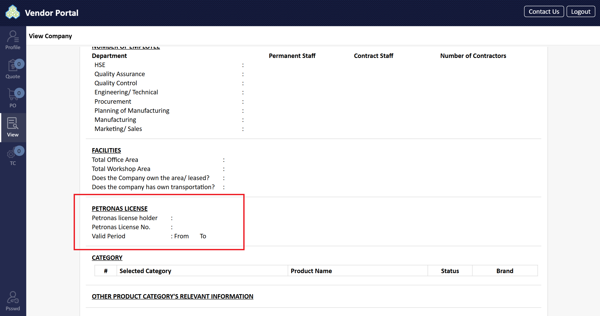
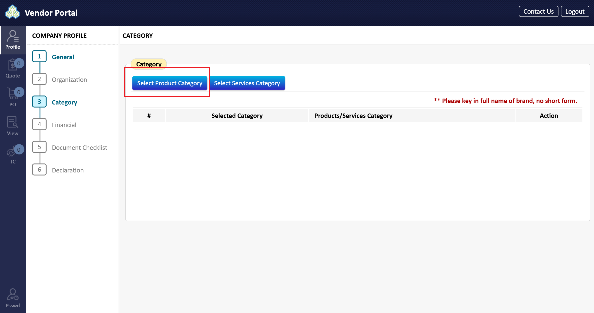
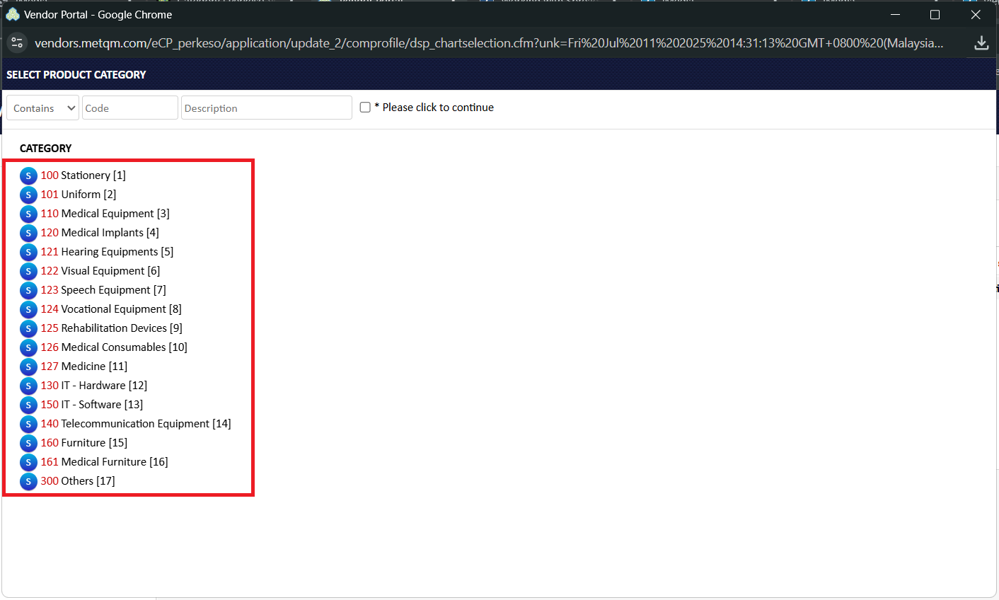
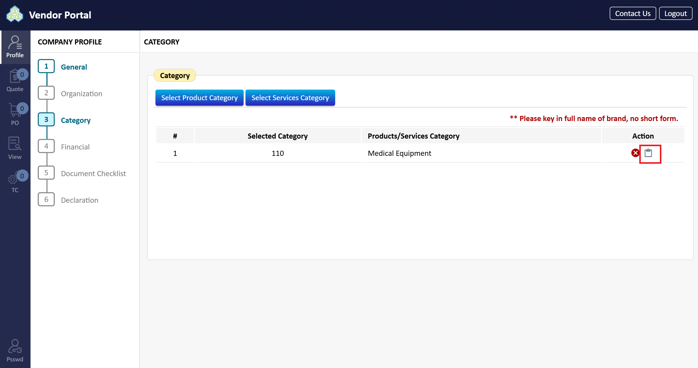
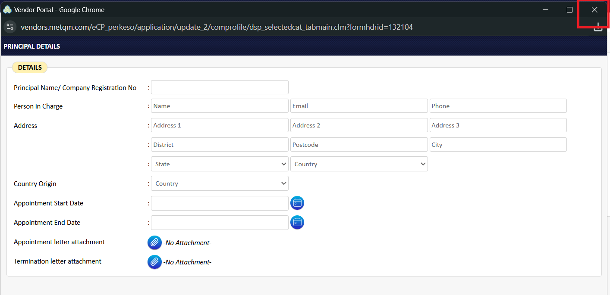
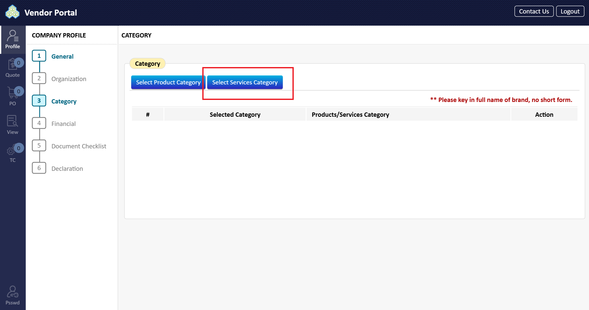
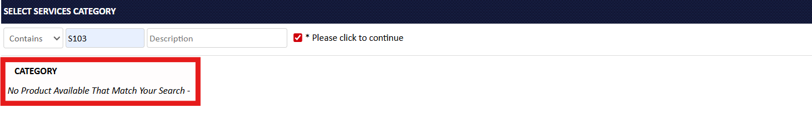

# Category

1. Complete the information related to your Petronas License: status (Petronas License holder), Petronas License Number, and the License Validity Period (From/To).
   * **Note:** If your company is not a Petronas License Holder, leave "Petronas License No" and "Validity period" blank.

2. In the 'Category' area, you must add the proper Product/Service Category for your company. Click "Select Product Category".

3. A 'Select Product Category' window will appear. Select one Product Category from the list (e.g., M08 INSULATION), then click to select the specific product category.

4. The selected Product Category will populate in the list.
   * In the 'Status' column, choose "\[Petronas License]" or "\[Non Petronas License]" from the dropdown list.
   * In the 'Brand' column, if it is a Product Category, it is mandatory to key in the full name of the brand. Service Category does not require a brand name.
   * **Note:** Avoid using short forms for brand names.
5. In the 'Action' column, click the "Appointment letter" button. A window will prompt you to enter the Principal Details. Enter the following:

| Field                                 | Description                                                   | Required (R) / Optional (O) / Conditional (C) |
| ------------------------------------- | ------------------------------------------------------------- | --------------------------------------------- |
| Principal Name/Co Registration Number | Principal Name/Co Registration Number                         | R                                             |
| Person In Charge                      | Person’s name, email, and phone                               | R                                             |
| Address 1                             | Unit/Block number, street name                                | R                                             |
| Address 2                             | Additional street name                                        | R                                             |
| Address 3                             | Additional street name                                        | R                                             |
| District                              | District                                                      | R                                             |
| Postcode                              | Postcode                                                      | R                                             |
| City                                  | City                                                          | R                                             |
| State                                 | State                                                         | R                                             |
| Country                               | Country                                                       | R                                             |
| Country Origin                        | Country Origin                                                | R                                             |
| Appointment Start Date                | Start Date of Appointment                                     | R                                             |
| Appointment End Date                  | End Date of Appointment                                       | R                                             |
| Appointment Letter attachment         | Letter of Appointment to be attached                          | R                                             |
| Termination Letter attachment         | Letter of Termination to be attached (if change of principal) | R                                             |

6. Close the window once the Principal Details are completed.

7. To add a service category, click the relevant button (similar to Product Category) and repeat steps 2-4.

8. Enter other relevant product category information in the provided text boxes. If the information is not available, key in "NA".

