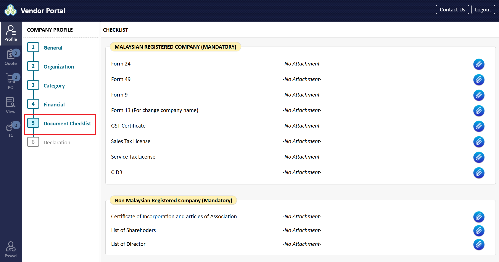
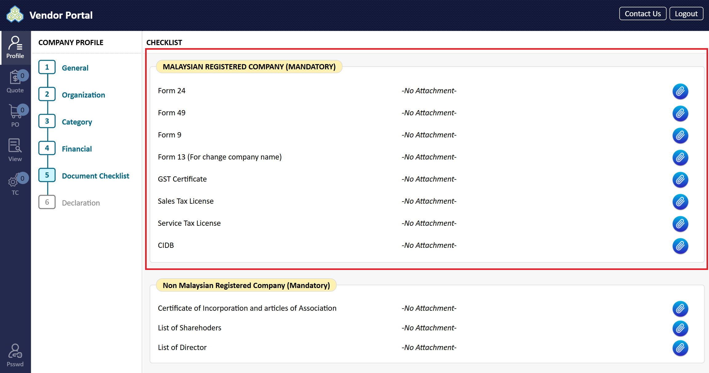
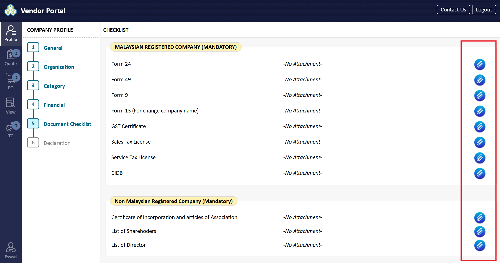
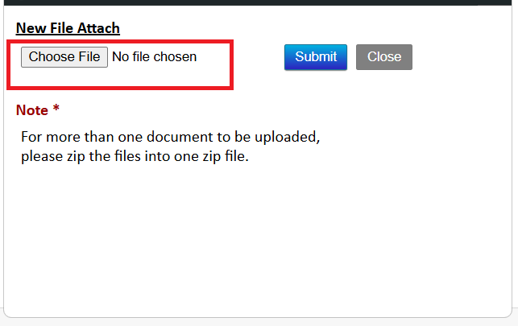
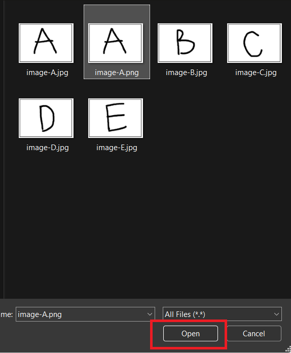
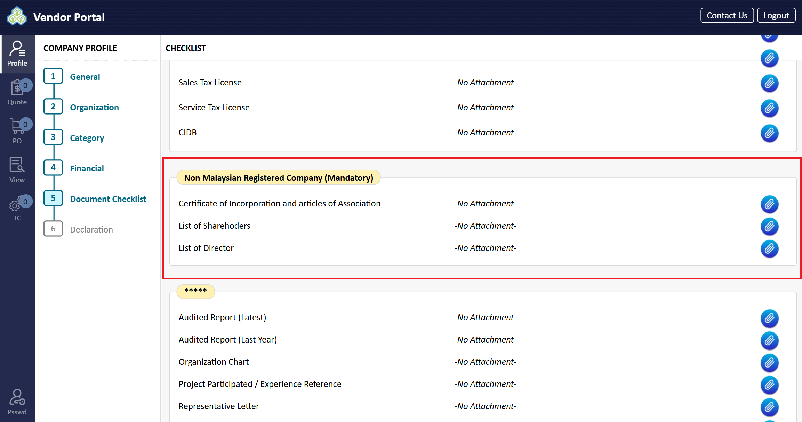
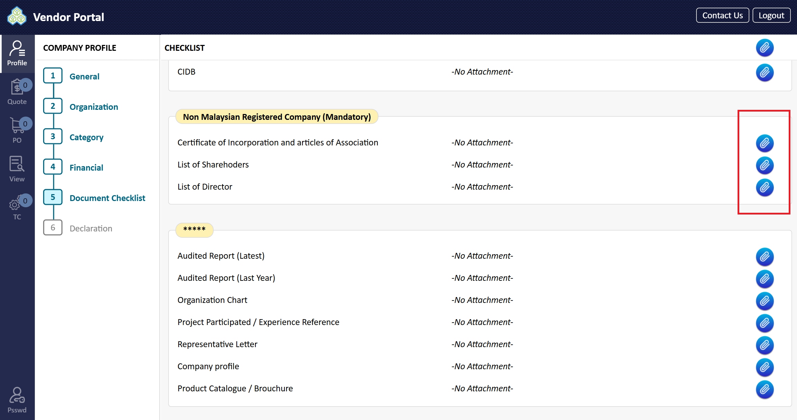
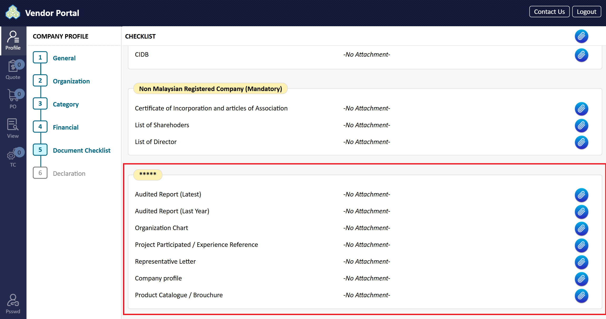

# Document Checklist

1. Attach all related certificates, letters, and required documents.

2. In the 'Malaysian Registered Company' area, attach all mandatory documents for Malaysian Registered Companies only.

3. Click the attach icon to upload files from your PC.

4. A window will pop up. Click the appropriate button (e.g., "Upload").

5. Locate and select the file to be attached from your PC. Then, click "Open" and verify that the file is attached.

6. In the 'Non Malaysian Registered Company' area, attach all mandatory documents for Non-Malaysian Registered Companies only.

7. Refer to steps 1-3 to attach these documents.

8. Other relevant documents such as Audited Report, Petronas License, Company Organization Chart, and Quality/HSE Policy can be attached in this section.

