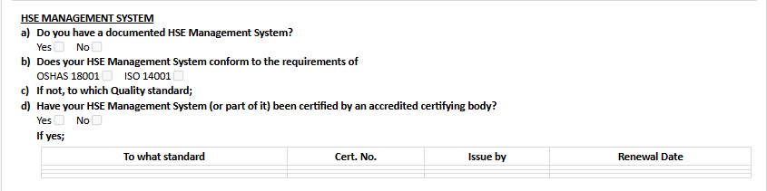
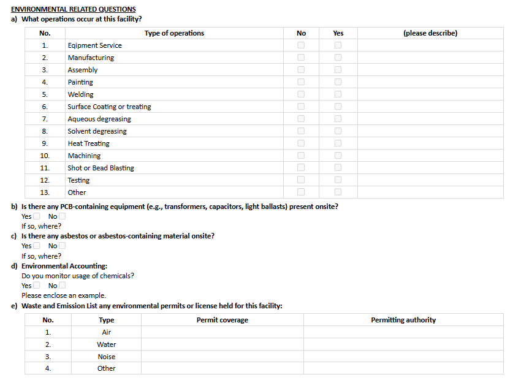

# HSE

1. Answer the questions with details.
   * **Note:** This section is not mandatory and only needs to be filled if you have the information.

2. In the 'Environmental Related Questions' area, choose "Yes" or "No" based on your operations and describe the operation type.
   * **Note:** This section is not mandatory and only needs to be filled if you have the information.

