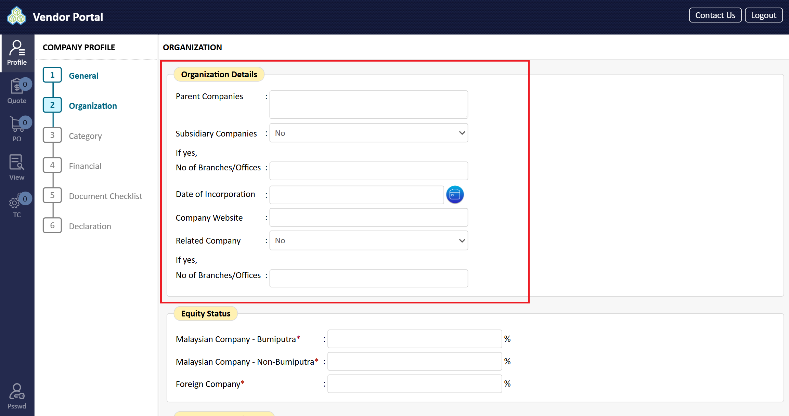
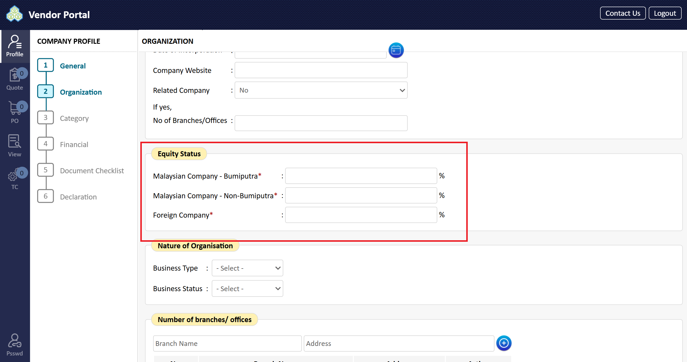
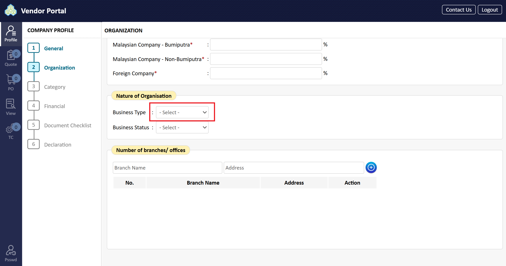
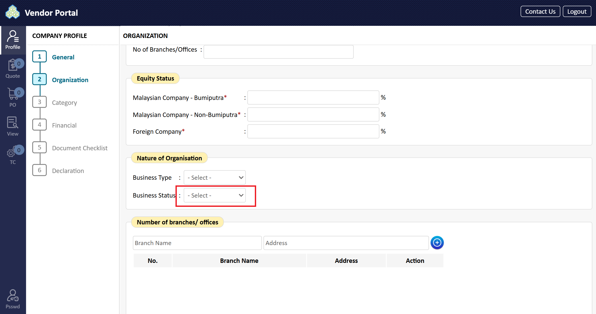
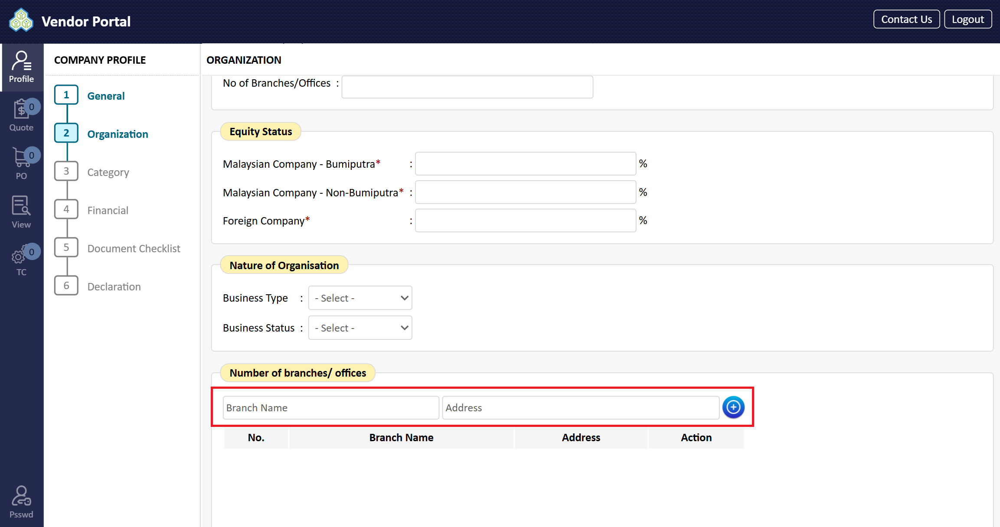
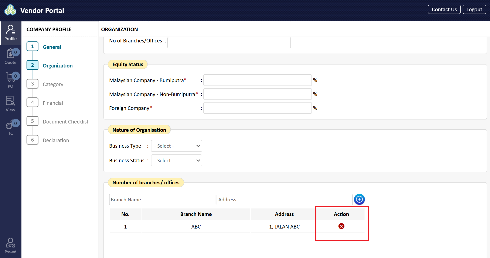
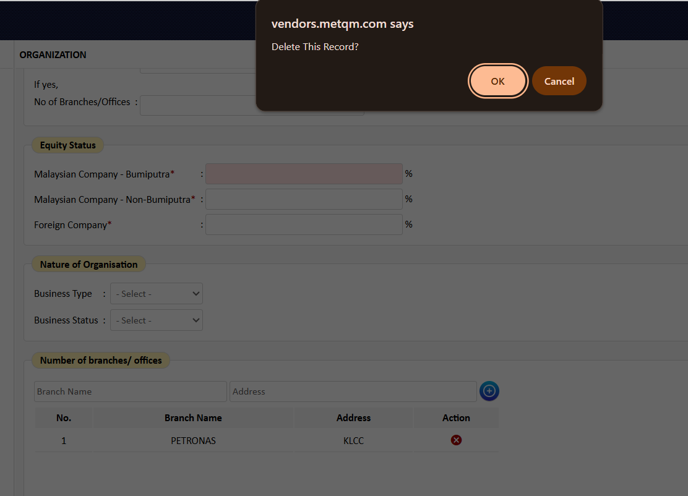

# Organization

1. In the 'Organization Details' area, enter the following:

| Field                 | Description                                                      | Required (R) / Optional (O) / Conditional (C) |
| --------------------- | ---------------------------------------------------------------- | --------------------------------------------- |
| Parent Companies      | List names of parent companies (key in NA if not applicable)     | R                                             |
| Subsidiary Companies  | List names of subsidiary companies (key in NA if not applicable) | R                                             |
| Date of Incorporation | Date of Incorporation (from calendar)                            | R                                             |
| Company website       | Corporate website of company (key in NA if not applicable)       | R                                             |

2. In the 'Equity Status' area, enter the following:

| Field         | Description                                              | Required (R) / Optional (O) / Conditional (C) |
| ------------- | -------------------------------------------------------- | --------------------------------------------- |
| Bumiputra     | % of Bumiputra's equity (key in 0 if no value)           | R                                             |
| Non-Bumiputra | % of Non-Bumiputra's equity (key in 0 if no value)       | R                                             |
| Foreign       | % or Quantity of Foreign's equity (key in 0 if no value) | R                                             |

3. In the 'Nature of Organisation' area, select the business type from the dropdown list.

4. Tick the appropriate 'Business Status' from the selection (e.g., Principal/Manufacturer, Exclusive Agent, Non-Exclusive Agent, Distributor, Stokist, Trader).

5. In the 'Number of Branches/Offices' area, if your company has other branches/offices, enter the Branch Name and Branch Address. Then, click "Add". Leave this section blank if no information.

6. To delete an incorrect branch entry, click the 'X' button in the 'Action' column.

7. A system message will prompt for confirmation. Click "OK" to confirm and delete the record.

8. Scroll down the page. In the 'Number of Employee' area, enter the number of staff in the provided boxes (Permanent Staff/Contract Staff/Where of Contractors). All fields are mandatory; if information is not available, key in "0".
   * **Note:** Attach the company organization chart in the 'Document Checklist' section.

9. In the 'Facilities' area, enter the following:

| Field                                 | Description                   | Required (R) / Optional (O) / Conditional (C) |
| ------------------------------------- | ----------------------------- | --------------------------------------------- |
| Total Office Area                     | Size of the office area       | R                                             |
| Total Workshop Area                   | Size of workshop area         | R                                             |
| Does the Company own the area/leased? | Choose from the dropdown list | R                                             |
