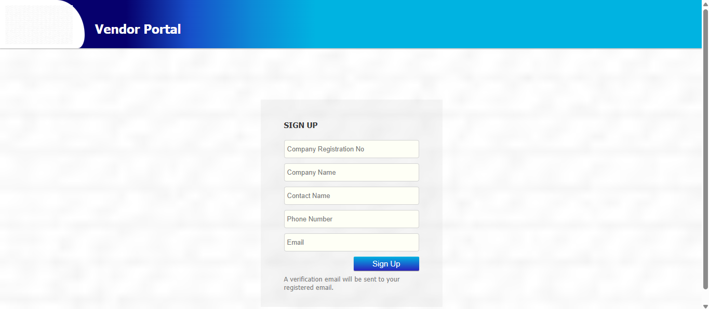

# Registration

This section guides you through the registration process.

### 1.0 Registration using Login ID and Password

1. Navigate to the [Perkeso Vendor Portal](https://vendors.sapuraenergy.com).

2. On the "Perkeso Vendor Portal" screen, click "New? Click here to sign up" to access the sign-up screen.

3. Enter all mandatory fields:
   * **Company Registration No:** Company registration number
   * **Company Name:** Name of the company
   * **Contact Name:** Contact person's name
   * **Phone Number:** Company Phone Number
   * **Email:** Company/Contact person's email to register as SEB vendor

4. Click "Sign Up" to register.

5. Log in to your email account to retrieve the temporary password. A verification email will be sent to your registered email.

